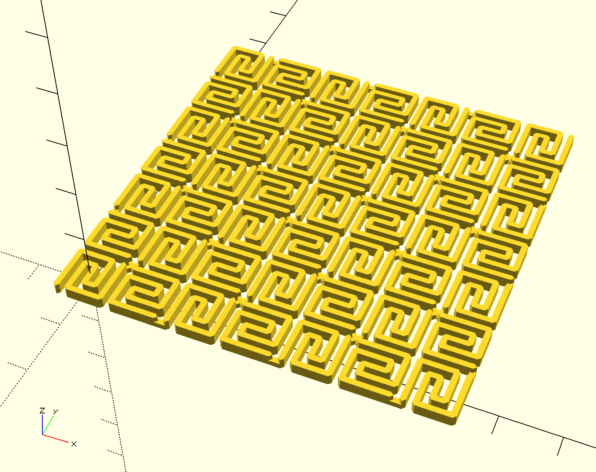
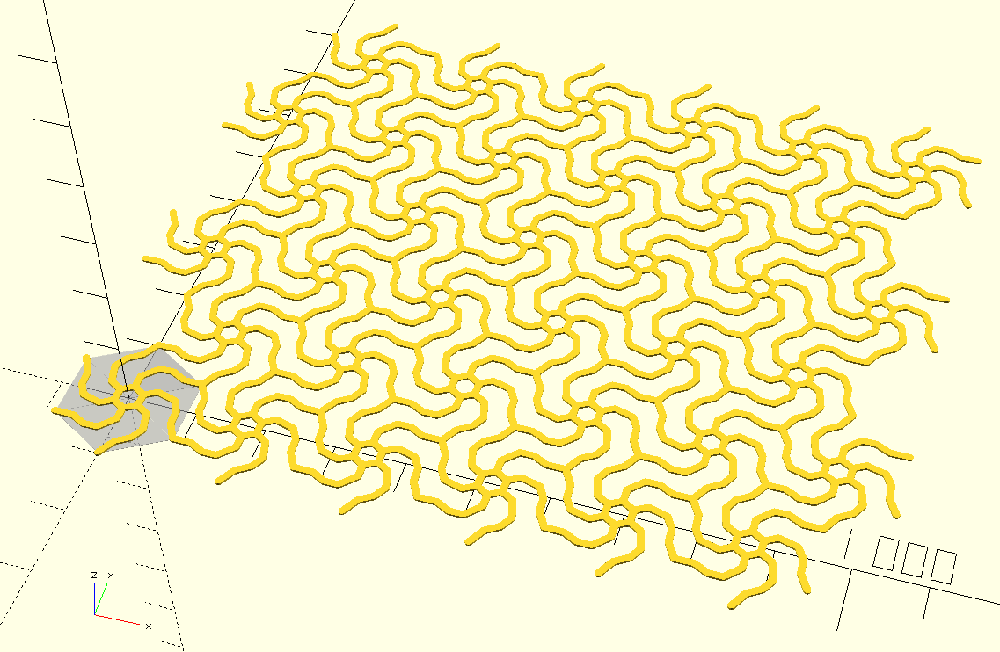

# FlexPattern1
Testing flexible 3d prints using PLA material. This is a simple S-like curve that can fill the space.
There are connectors carefully placed to make the print stronger, but not too strong (remain flexible).

# FlexPattern2
Shapes with end-points at hexagon vertices can be easily tiled to produce an arbitrary sized flex pattern.

